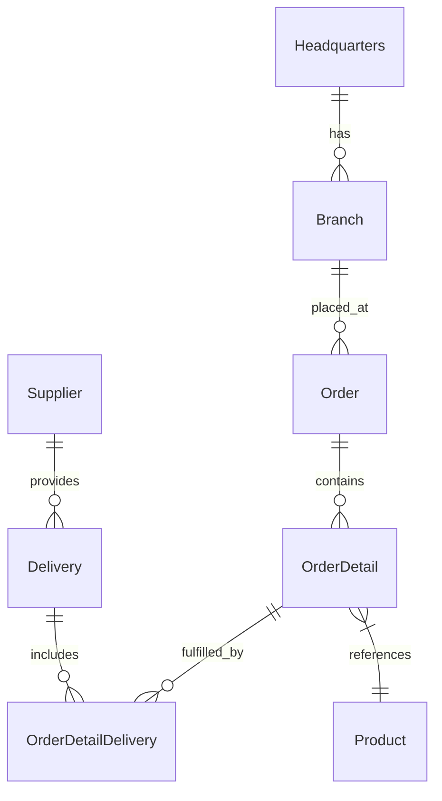

# 🚀 OctoCAT Supply: The Ultimate GitHub Copilot Hands-On Demo v2.0


Welcome to the OctoCAT Supply Website - your go-to demo for showcasing the incredible capabilities of GitHub Copilot, GHAS, and the power of AI-assisted development!

## ✨ What Makes This Demo Special

This isn't just another demo app - it's a carefully crafted showcase that demonstrates the full spectrum of GitHub's AI capabilities:

- 🤖 **Copilot Agent Mode & Vision** - Watch Copilot understand UI designs and implement complex features across multiple files
- 🎭 **MCP Server Integration** - Demonstrate extended capabilities with Playwright for testing and GitHub API integration
- 🧪 **Test Generation** - Exhibit Copilot's ability to analyze coverage and generate meaningful tests
- 🔄 **CI/CD & IaC** - Generate deployment workflows and infrastructure code with natural language
- 🎯 **Custom Instructions** - Show how Copilot can be tailored to understand internal frameworks and standards
- 📜 **Custom Prompt Files** - Automate repetitive tasks and documentation updates with ease

---

## 💻 Hands-On Scenarios

1. **GUIDED HANDS-ON: Create Custom Instructions and a Custom Prompt File**
   This activity will be performed together as a group.
   - Use GitHub Copilot Ask Mode and Agent to ask Copilot about the API of the project or any other question about your repo.  
      - Sample Prompt: `Please give me details about the API of this project.`
      - Sample Prompt: `Are there any core features missing in my project?`
      - Bonus: `Explain the database operations with mermaid`
   - Use GitHub Copilot Internal Prompting to update the custom instructions for the OctoCAT Supply project.
      - Use the `Gear` icon in the GitHub Copilot Chat window to select the `Generate Agent Instructions` internal prompt. 
         - Create a generic (project wide) GitHub Copilot Instructions file.
            - Hint: This file should be in the base directory of the `.github` folder and have the name `copilot-instructions.md`.
         - Create an API specific GitHub Copilot Instructions file using the same process as before.
            - Hint: This file should be in the `.github/instructions` directory and have a name that resembles `API.instructions.md`
            - Sample Prompt: `Please create an API Specific custom instructions set and save in  #API.instructions.md `
   - Ask GitHub Copilot questions about your project and discover the use of the `Custom Instructions` files that have been created. 
      - How does your response compare to before?
   - Review Existing GitHub Copilot Prompt files to learn about how they can help speed up your workflow.  Execute one if you'd like.

2. **GUIDED HANDS-ON: Create a Custom Agent (Chat Mode)**
   This activity will be performed together as a group.
   - Have Copilot Create a Custom Agent (Chat Mode) using **Agent Mode**
      - Use the `Gear` icon in the GitHub Copilot Chat window to select the `Modes` internal prompt.
         
         **Hint: Sample Custom Agent:**
         ```markdown
         ---
         tools: ['search', 'githubRepo', 'todos', 'github/create_pull_request_with_copilot']
         description: Explore implementation ideas
         model: Claude Sonnet 4
         ---
         Your goal is to creatively explore an idea and implement potential solutions.

         FIRST deeply research (using search tools, run in parallel as much as possible) the problem and solution space for the given idea.

         THEN implement the solutions in this codebase in collaboration with coding agent. For each variation, call GitHub's `create_pull_request_with_copilot`. Focus on handing over the implementation details, Copilot coding agent will handle the step by step implementation. Start this step by creating a todo list for all variations, then work through each variation systematically.

         Pause.
         ```

---
### 🛑 If you were unable to complete steps 1 & 2, please merge `Phase_1` branch into `main` to proceed 🛑 ###
---
3. **Requirements Specifications and Agentic Implementation**
   - Use previously developed `custom chat mode` to define features and create an implementation plan
      - Use the /docs/design/MonaFigurine.png file (found in ./docs/design) to create a new product offering on the website.
          - Sample Prompt: `Using the design in the ./docs/design/MonaFigurine.png file, create an a new product offering to the OctoCAT Supply website.  Price is $32.99, SKU is MONA-001, and description is "A beautiful handcrafted figurine inspired by the Mona Lisa."`
      - Generate UI components from design mockups (using Copilot Vision) and Generated Implementation Plan.
      - Review the Pull Request in your Repo that was created by Copilot Agent Mode and merge the one you like best.
   - Use GitHub Copilot Agent mode to the Create Cart Page and Cart Icon.
      - Syncronize your branch with the latest main branch.
      - Start a New Chat using Agent Mode.  Select the Claude Sonnet 4 model or any other model that supports Agent Mode.
      - Drag the cart.png file (found in ./docs/design) into the chat window.
      - Ask Copilot to implement the a simple cart icon and cart page that displays the items in the cart.

---
4. **Test Generation and Coverage Improvement**
   - Analyze existing test coverage using `Ask` Mode. 
       - Sample Prompt:  `Please analyze my current test coverage and identify any missing test cases.`
   - Generate unit and integration tests with Copilot
      - Hint: Use the "unit test coverage" prompt to generate unit tests for the Product and Supplier routes.
   - Improve coverage based on analysis
   - BONUS: Ask GitHub Copilot to execute the tests using the Playwright MCP server.
---
5. **Documentation Update**
   - Use GitHub Copilot Internal Prompting to create a custom prompt file for the OctoCAT Supply project to update all existing documentation for the project.
       - Hint: Use the "Prompt Files" prompt to create a custom prompt file for the OctoCAT Supply project.
       - Sample Prompt: `Complete the prompt file to update the documentation of this project or the specified file mentioned by the user.  Only update the prompt file, do not update any documentation.`
    - Execute the custom prompt file to update all existing documentation for the project.
        - Hint: Use the slash command to execute the prompt all existing documentation for the project.  Specify the README.md file and the docs/architecture.md file if you only want that updated. 

---

## 🏗️ Architecture

The application is built using modern TypeScript with a clean separation of concerns:



### Tech Stack
- **Frontend**: React 18+, TypeScript, Tailwind CSS, Vite
- **Backend**: Express.js, TypeScript, OpenAPI/Swagger
- **DevOps**: Docker

---

## 🚀 Getting Started

1. Clone this repository
2. Build the projects:
   ```bash
   # Build API and Frontend
   npm install && npm run build
   ```
3. Start the application:
   ```bash
   npm run dev
   ```

Or use the VS Code tasks:
- `Cmd/Ctrl + Shift + P` -> `Run Task` -> `Build All`
- Use the Debug panel to run `Start API & Frontend`

## 🛠️ MCP Server Setup (Optional)

Use VS Code command palette:
   - `MCP: List servers` -> `playwright` -> `Start server`

## 📚 Documentation

- [Detailed Architecture](./docs/architecture.md)
- [Build Instructions](./docs/build.md)

---

## 🙌 Acknowledgements
** GitHub Universe 2025 Demo Contributors:  Dustin Ellis (@ellisd4), Harald Kirschner (@digitarald), Joel Norman (@microsoftnorman)

** GitHub Universe 2025 Demo Testers: Tina Saulsberry (@Snuckles2)


*This entire project, including the hero image, was created using AI and GitHub Copilot! Even this README was generated by Copilot using the project documentation.* 🤖✨
